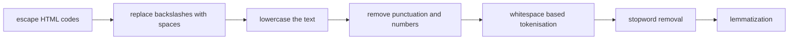

# Findings (400 marks)
# GENERAL SUMMARY GUIDELINES

After completing all Classical Machine Learning and deep learning models experiments (LSTM, GRU, CNN, BERT), you must write a comprehensive and well-structured summary of your findings.
This summary is a mandatory component and will be strictly evaluated for completeness, depth, and clarity.

Your summary should include:
* A clear description of each model implemented (ML Models, LSTM, GRU, CNN variants, BERT fine-tuning)
* Quantitative results, final metrics (Accuracy, Precision, Recall, F1-score)
* Qualitative interpretation, what the results imply about each model’s behavior, strengths, and weaknesses.
  - Comparative analysis across models:

  - Performance vs. Complexity (e.g., BiLSTM with Attention gives best accuracy but highest cost).

  - Training time and resource consumption.

  - Impact of architecture choices (attention, bidirectionality, pooling type, etc.).

**Important:** **Submitting only plots or tables without a coherent written summary will result in a significant deduction of marks.**
**Your goal is to demonstrate understanding, not just execution. Treat this section as a short analytical report. This section represents your ability to synthesize results and communicate findings professionally.**

# Part A summary
### 1.5 Report Your Findings
After completing the Exploratory Data Analysis (EDA), you must write a comprehensive summary of your observations. This summary should not be a casual paragraph, it is an essential component of your report and will be evaluated for clarity, completeness, and analytical depth.

Your summary should:

* Concisely describe what you observed (e.g., data size, text characteristics, missing values, class imbalance, vocabulary richness).

* Explain why those observations matter for the next steps — for example, how class imbalance might affect model performance, or how frequent words indicate dataset bias.

**Important:** **Submitting only plots or tables without a coherent written summary will result in a significant deduction of marks.**
**Your goal is to demonstrate understanding, not just execution. Treat this section as a short analytical report, it reflects how well you’ve understood the data.**
# Part B summary
### 2.4 Report Your Findings (100 marks)
After completing all model training and evaluations, you must write a comprehensive summary of your results.
This summary is a core graded component and will be strictly evaluated for completeness, accuracy, and clarity of presentation.

Your summary must include:

* Numerical performance results (Accuracy, Precision, Recall, F1-Score, ROC Plot, AUC) for each model–embedding combination.
* Model-wise observations: Briefly describe the overall behavior of each model across embeddings (e.g., consistency, stability, or variation in results).
* Embedding-wise observations: Summarize how each embedding method performed across different models.
* Brief interpretation of observed trends, stated factually based on the results (e.g., “Word2Vec and FastText embeddings showed similar performance across models; TF-IDF performed competitively on simpler models”).

**Important:** **Submitting only plots or tables without a coherent written summary will result in a significant deduction of marks.**
**Your goal is to demonstrate understanding, not just execution. Treat this section as a short analytical report. This section represents your ability to synthesize results and communicate findings professionally.**

# Part C Summary
### Findings
After completing all Classical Machine Learning and deep learning models experiments (LSTM, GRU, CNN, BERT), you must write a comprehensive and well-structured summary of your findings.
This summary is a mandatory component and will be strictly evaluated for completeness, depth, and clarity.

Your summary should include:
* A clear description of each model implemented (ML Models, LSTM, GRU, CNN variants, BERT fine-tuning)
* Quantitative results, final metrics (Accuracy, Precision, Recall, F1-score)
* Qualitative interpretation, what the results imply about each model’s behavior, strengths, and weaknesses.
  - Comparative analysis across models:

  - Performance vs. Complexity (e.g., BiLSTM with Attention gives best accuracy but highest cost).

  - Training time and resource consumption.

  - Impact of architecture choices (attention, bidirectionality, pooling type, etc.).

**Important:** **Submitting only plots or tables without a coherent written summary will result in a significant deduction of marks.**
**Your goal is to demonstrate understanding, not just execution. Treat this section as a short analytical report. This section represents your ability to synthesize results and communicate findings professionally.**

# Evaluation Criteria
1. **Data Preprocessing and EDA(300 points)**

2. **Machine Learning Models (1000 points)**
[100 $\times$ 4 embedding methods + 100 $\times$ 4 ML Models + 100 for Analysis Ques + 100 for Report]
   - Implementation, training, and evaluation of ML models.
3. **Deep Learning Models (2400 points)**
[(600 + 100 + 100) $\times$ 3]
   - Implementation and training of LSTM, GRU, CNN with variants.
4. **Fine-tuning BERT (600 points)** [400 + 100 + 100]
   - Successful fine-tuning and performance evaluation.
5. **Report and Code Quality (100 points)**
   - Clear explanations, visualizations, and well-structured code.
6. **Innovation and Novel Approaches (50 points)**
   - Additional experiments, creativity, and analysis.

